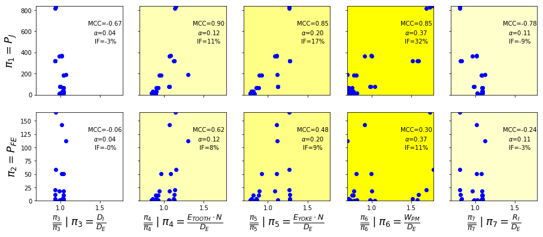

 

## About

pyVPLM is a package that is developed to help scientist, engineer, etc., to construct power-law and/or polynomial regression models on different type of data such as finite-element simulation results, manufacturer data-sheets...

It integrates various functionalities such as :

- Model parameters reduction based on Buckingham Theorem dimensional analysis and [Pint](https://pint.readthedocs.io/en/0.9/) package with derived functions.
- Sensitivity and dependency analysis on dimensionless parameter and limited experiments to simplify further model expressions.
- Construction of optimized experimental design on feasible-physical variables leading to full-factorial design within dimensionless space. Those DOE are the inputs of parametrized finite-element models.
- Regression models construction with increasing  complexity (terms sorted based on their impact) and validation based on relative error repartition analysis.

## Capabilities

#### Dimensional analysis

The dimensional analysis has to be conducted on a defined set of physical parameters. It can be performed using alternatively `buckingham_theorem` which will return the default solution or `automatic_buckingham` which will propose different alternate sets.

Based on the obtained solutions, advanced user can also define manually a new solution set with `force_buckingham` function.

```
from pyvplm.core.definition import PositiveParameter, PositiveParameterSet
from pyvplm.addon.variablepowerlaw import buckingham_theorem
d = PositiveParameter('d', [10e-3, 150e-3],'m', 'pipe internal diameter')
e = PositiveParameter('e', [.1e-3, 10e-3], 'm', 'pipe thickness')
parameter_set = PositiveParameterSet(d,e)
pi_set, _ = buckingham_theorem(parameter_set, track=False)
```

#### Sensitivity & dependency analysis

Once dimensional analysis is done, there may be still a huge number of dimensionless parameter to describe a performance criteria (mostly form factor) and DOE construction phase may lead to big experiments number and long simulation times.

This is to answer this problematic that `pi_sensitivity` and `pi_dependency` functions have been designed. The obtained graph for analysis are based on primary vs. secondary parameters analysis that can be easily adapted using configuration parameters:



------


#### Optimized design of experiments

The non-constrained nor reduced experimental set are defined using [pyDOE2](https://github.com/clicumu/pyDOE2) package. It integrates automatic sizing of physical/dimensionless initial test plans and functions for selection based on distance criteria (dimensionless mapping) and spread quality (physical mapping).


------


#### Regression models construction

The `regression_models` function interpolate results to fit a given order polynomial model within linear or logarithmic space. Within log space, the model obtained can be transformed into variable power-law model, indeed:
$$
log(\pi_0) = a_0+a_1 \cdot log(\pi_1) + a_{11} \cdot log(\pi_1)^2+a_{12} \cdot log(\pi_1) \cdot log(\pi_2) + a_2 \cdot log(\pi_2) +...
$$
Can be expressed in the following form:
$$
\pi_0 = 10^{a_0} \cdot \pi_1 ^{a_1 + a_{11} \cdot log(\pi_1)+a_{12} \cdot log(\pi_2)+...} \cdot  \pi_2^{a_2+...} \cdot ...
$$
This is the origin of package name since variable power-law model is one of the current research subject of MS2M team in [ICA](http://institut-clement-ader.org/home/) Laboratory (Toulouse-France). 

Regression coefficients are sorted with increasing magnitude while considering standardized values regression (first order terms are selected at the beginning to avoid singularity issues):


<u>The four criteria to evaluate model fidelity with leave-one-out cross-validation are:</u>

1. Maximal relative error magnitude
2. Average value of the magnitude of relative error which is a good indicator of both average and standard deviation
3. Average value of the relative error
4. Standard deviation of the relative error

On this example with 2 dimensionless parameters and order 3 polynomial expression, a 5-terms model seems to have good representation capabilities.

------

Once regression models have been constructed, each one of them can be analyzed trough the analysis of their relative error using `perform_regression` function:


## Examples and notes

Four Jupyter Notebooks have been developed to present tool capabilities and functions. They can either be launched using `.batch` files from `master/notebooks` folder for windows users, or launching Jupyter Notebook application and opening `.ipynb` files from `master/docs/source/_static/Pyhton_Notebooks` folder.

Additional documentation on sub-packages (`pyvplm.core`, `pyvplm.addon`) and functions can be find on the interactive documentation `master/docs/build/index.html` which can be launched within windows operating system with double-click command on `User guide.bat` file.

## Install

To install pyVPLM, simply run:

`pip install pyvplm`

## License

This project is under MIT License [<https://opensource.org/licenses/MIT>]

## Credit

pyVPLM is an adaptation of the work performed by MS2M team at [ICA Laboratory](http://institut-clement-ader.org/) - France and covers the work done during different doctorate thesis:

- Copyright (C) 2014 - 2017 - Florian Sanchez
- Copyright (C) 2017 - 2019 - Francesco De Giorgi

## Author

[A. Reysset](https://www.researchgate.net/profile/Aurelien_Reysset)

## References

- F. Sanchez, M. Budinger, I. Hazyuk, "*Dimensional analysis and surrogate models for thermal modeling of power electronic components*", Electrimacs conference (2017), Toulouse
- F. Sanchez, M. Budinger, I. Hazyuk, "*Dimensional analysis and surrogate models for the thermal modeling of Multiphysics systems*",  [Applied Thermal Engineering](https://www.researchgate.net/journal/1359-4311_Applied_Thermal_Engineering) 110 (August 2016)

